<!-- Envie este arquivo e assets/profile-header.svg para SilasPires/silaspires. -->

<div align="center">
  

  <h3>From idea and architecture to code and production.</h3>

  <p>
    <a href="https://www.linkedin.com/in/silas-pires-720918190/"></a>
    <a href="mailto:pro.silaspires@gmail.com"></a>
    <a href="https://pendulocompany.com.br/"></a>
  </p>
</div>

---

### `> whoami`

I'm a software engineer and the founder of **Pêndulo & Co.** I build products that connect interfaces, APIs, infrastructure, and real business operations. My work spans full-stack applications, integrations, automations, and AI agent systems. I enjoy owning the path from problem discovery and architecture to a working product.

🇧🇷 **Em português:** sou engenheiro de software em Vitória da Conquista, BA. Crio produtos digitais, integrações e sistemas com IA, com foco em resolver problemas reais de ponta a ponta.

---

## What I Build

<table>
  <tr>
    <td width="50%" valign="top">
      <h3>🧩 Product Engineering</h3>
      Web and mobile products shaped around real users, business needs, and production constraints.
    </td>
    <td width="50%" valign="top">
      <h3>⚙️ Systems & Integrations</h3>
      APIs, data flows, automations, infrastructure, and integrations that connect the pieces.
    </td>
  </tr>
  <tr>
    <td width="50%" valign="top">
      <h3>🤖 AI Agents</h3>
      Specialist agents connected to tools, APIs, repositories, and workflows with clear responsibilities.
    </td>
    <td width="50%" valign="top">
      <h3>🔌 Connected Operations</h3>
      Apps that connect field data, devices, photos, computer vision, and automation into reliable processes.
    </td>
  </tr>
</table>

<details>
<summary><b>More about what I'm building / O que estou construindo</b></summary>
<br />

- **AI agents:** specialist agents connected to tools, APIs, repositories, and development workflows.
- **Business software:** order flows, operations dashboards, logistics, ERPs, and internal systems.
- **Connected experiences:** mobile apps, computer vision, hardware integrations, and real-time interfaces.
- **Automation:** workflows connecting APIs, webhooks, databases, AI models, and business processes.

</details>

---

## Selected Work

| Project | What it explores |
| :--- | :--- |
| [**Atlas System**](https://github.com/SilasPires/atlas-system) | A voice-first local AI assistant with a browser interface and a foundation for multi-agent orchestration. |
| **Easy Order** · Pêndulo & Co. | A digital ordering experience for restaurants, from QR menus and table orders to operations tools. |
| **Construction Load Control** | A field workflow for recording drivers, materials, routes, photos, and signatures, designed around real worksite conditions. |
| [**Self Checkout**](https://github.com/SilasPires/self-checkout) | A public TypeScript project from my application portfolio. |

> Some commercial work lives in private repositories. The links above point only to public code.

---

## 🧰 Tech Stack

<p align="center">
  
</p>

<br>

<table align="center">
  <tr>
    <td align="center" width="300">
      <strong>Frontend & Mobile</strong>
      <br><br>
      
      <br><br>
      <sub>TypeScript • React • Next.js • React Native</sub>
    </td>
    <td align="center" width="300">
      <strong>Backend & APIs</strong>
      <br><br>
      
      <br><br>
      <sub>Node.js • Python • REST APIs • Webhooks</sub>
    </td>
  </tr>
  <tr>
    <td align="center" width="300">
      <strong>Database & Backend Services</strong>
      <br><br>
      
      <br><br>
      <sub>PostgreSQL • Supabase • SQLite</sub>
    </td>
    <td align="center" width="300">
      <strong>Cloud & Infrastructure</strong>
      <br><br>
      
      <br><br>
      <sub>AWS • Docker • Linux • VPS</sub>
    </td>
  </tr>
  <tr>
    <td align="center" width="300">
      <strong>Automation & Integration</strong>
      <br><br>
      
      <br><br>
      <sub>n8n • APIs • Webhooks • Git • GitHub</sub>
    </td>
    <td align="center" width="300">
      <strong>Hardware & Edge</strong>
      <br><br>
      
      <br><br>
      <sub>Raspberry Pi • Arduino • IoT • Computer Vision</sub>
    </td>
  </tr>
</table>

---

## 🤖 AI Stack

<p align="center">
  
  
  
  
  
</p>

<p align="center">
  <sub>
    AI agents • agent orchestration • tool calling • LLM integrations • AI-assisted engineering • autonomous workflows
  </sub>
</p>

---

## Core Focus

<p align="center">
  
  
  
  
  
  
</p>

---

## GitHub Activity

<div align="center">
  
  
</div>

<br>

<div align="center">
  
</div>

---

## Signature

```txt
Building products from idea → architecture → code → production
```

<p align="center">
  <sub>Good software starts with understanding the problem. Let's build something useful.</sub>
  <br><br>
  <a href="mailto:pro.silaspires@gmail.com"><b>Get in touch →</b></a>
</p>
